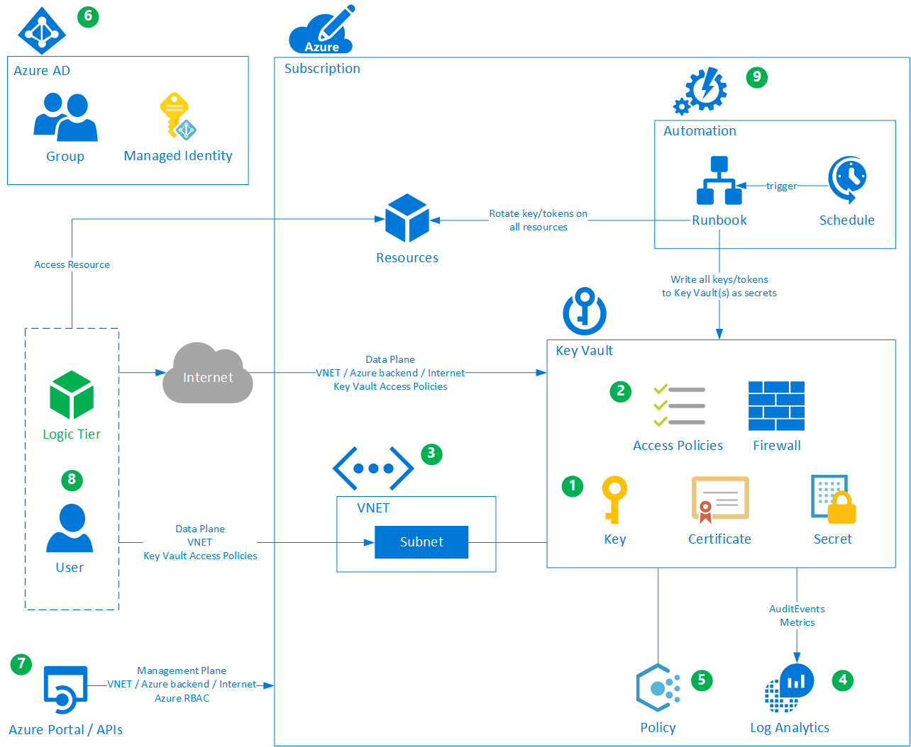

# Azure Key Vault

| Key | Value |
|--|--|
| ComponentId | azkeyvault |
| ComponentVersion | 1.0.0 |

[[_TOC_]]

| Azure Provider | Repository |
|--|--|
|[azurerm_key_vault](https://www.terraform.io/docs/providers/azurerm/r/key_vault.html) | [azure-kv-module](https://dev.azure.com/energinet/CCoE/_git/azure-kv-module) |
|[azurerm_key_vault_access_policy](https://www.terraform.io/docs/providers/azurerm/r/key_vault_access_policy.html) | [azure-kv-module](https://dev.azure.com/energinet/CCoE/_git/azure-kv-module) |
|[azurerm_monitor_diagnostic_setting](https://www.terraform.io/docs/providers/azurerm/r/monitor_diagnostic_setting.html) | [azure-kv-module](https://dev.azure.com/energinet/CCoE/_git/azure-kv-module) |

## Introduction

This Module creates the following resources:

- [Key Vault](https://azure.microsoft.com/en-us/services/key-vault/)
- [Key Vault Access Policy](https://docs.microsoft.com/en-us/azure/key-vault/general/secure-your-key-vault)
- [Key Vault Monitor Diagnostic Setting](https://docs.microsoft.com/en-us/azure/azure-monitor/insights/key-vault-insights-overview)

## Releases

| Version | Release Notes | Version Build Status |
|--|--|--|
| [1.0](./Azure-Key-Vault/code/readme.md?version=GT1.0) | CSF Policy compliant. |  |

## Overview

[Read the full documentaion here](./Azure-Key-Vault/readme.md)!  

[Azure Key Vault](https://docs.microsoft.com/en-us/azure/key-vault/general/overview) is used to safely store keys, secrets and certificates (called artifacts in this document). Optionally the artifacts can be backed by Hardware Security Modules (HSM).

Key Vaults support the creation, usage and management of artifact such as [Keys, Certificates and Secrets](https://docs.microsoft.com/en-us/azure/key-vault/general/about-keys-secrets-certificates). A Key Vault instance is used per application and per environment. Some development teams use Key Vaults to store environment specific variables for the business applications. This offers the advantage to store all variables in one central tool.

All Key Vaults are [replicated](https://docs.microsoft.com/en-us/azure/key-vault/general/disaster-recovery-guidance) to the Azure paired region. There is no backup required and the same URL's can be used in case of a Microsoft induced failover.

## Access Control

Authentication to access the artifacts is controlled by [Access Policies](https://docs.microsoft.com/en-us/azure/key-vault/general/assign-access-policy-portal) or [Azure RBAC](https://docs.microsoft.com/en-us/azure/key-vault/general/rbac-guide). Access Policies allow for a [more granular configuration](https://docs.microsoft.com/en-us/azure/key-vault/general/rbac-migration#access-policies-templates-to-azure-roles-mapping) than the Azure RBAC built-in roles. Access control can't be defined for individual artifacts but only for artifact classes (keys, secrets, certificates). This is one of the reason a Key Vault instance is required for each application.

Network access control is supported by use of [Firewall and VNET integration](https://docs.microsoft.com/en-us/azure/key-vault/general/secure-your-key-vault#firewalls-and-virtual-networks).

## VNET Integration

A Key Vault can be integrated into a VNET by using both [VNET Service Endpoints](/Components/Controls/Network-Connectivity#vnet-service-endpoints-/-with-policies) and [Private Endpoints](/Components/Controls/Network-Connectivity#private-endpoints).

## Monitoring

Audit events and metrics are forwarded to a Log Analytics workspace in the Resource Group.

## Key Vault specific Policies

Multiple [Azure Policy definitions](https://docs.microsoft.com/en-us/azure/key-vault/security-controls-policy?toc=/azure/key-vault/general/toc.json&bc=/azure/key-vault/breadcrumb/toc.json) are available that are specific to Key Vault.

## Azure Active Directory Objects

Key Vault doesn't require any objects in Azure AD, with the exception of the Access Policies/RBAC. Based on the [authentication option](https://docs.microsoft.com/en-us/azure/key-vault/general/secure-your-key-vault#key-vault-authentication-options) chosen, either AD groups or Service Principals are required in Azure AD.

## Management Plane access

Management plane access is via the Portal or corresponding [API](https://docs.microsoft.com/en-us/rest/api/keyvault/). Authentication is performed using Azure RBAC. Access to the management plane doesn't provide access to the artifacts, the data plane is used for that purpose.

## Data Plane access

Data plane access in Key Vault controls any kind of interaction with the artifacts. This requires either the configuration of Access Policies or Azure RBAC with data plane type roles.

Policies/RBAC can be structured to provide access to certain artifact types, but can't be used to limit access to specific artifacts. For this reason multiple Key Vaults might have to be deployed. Example: Artifact1 is available to both applications where as Artifact2 is only accessible to one of the two applications.

Key Vault owners are free to capture any type of secret in their Key Vault. However, for secrets that are related to Azure Resources, a specific [naming convention](/Foundation/Key-Rotation/Naming-Convention) is to be followed. This ensures that keys rotated on Azure Resources stay in sync with the secrets stored in Azure Key vault.

## Key Rotation

Security artifacts of Azure resources (keys, tokens etc.) are regularly [rotated](/Foundation/Key-Rotation) and updated in Key Vault. This rotation can be performed by an Azure Automation Runbook such as [TEC0027-KeyRotation](/Automation-and-IaC/Runbooks/TEC0027).
