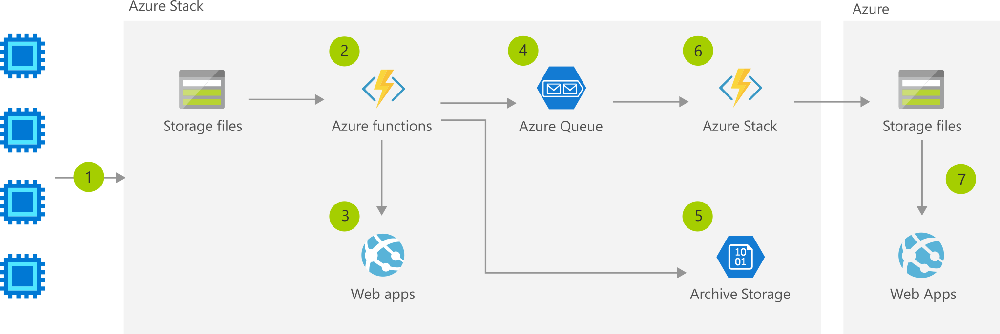

# Architecture

The Storage Component is one of the most fundamental of all Azure Services. Here follows a sample for how storage is used to transfer data from customers into processing by Azure Functions where the result is stored in a staging storage account for display on a web site (Azure App Service).

## Data Flow

1. Data flows into a storage account.
1. Function on Azure Stack analyses the data for anomalies or compliance.
1. Locally-relevant insights are displayed on the Azure Stack app.
1. Insights and anomalies are placed into a queue.
1. The bulk of the data is placed into an archive storage account.
1. Function sends data from queue to Azure Storage.
1. Globally-relevant and compliant insights are available in the global app.

## Components

[Storage](https://azure.microsoft.com/services/storage): Durable, highly available, and massively scalable cloud storage.  
[Azure Functions](https://azure.microsoft.com/services/functions): Process events with serverless code.  
[Azure Stack](https://azure.microsoft.com/overview/azure-stack): Build and run innovative hybrid applications across cloud boundaries.
